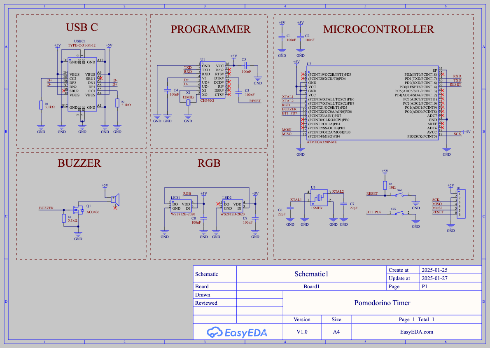
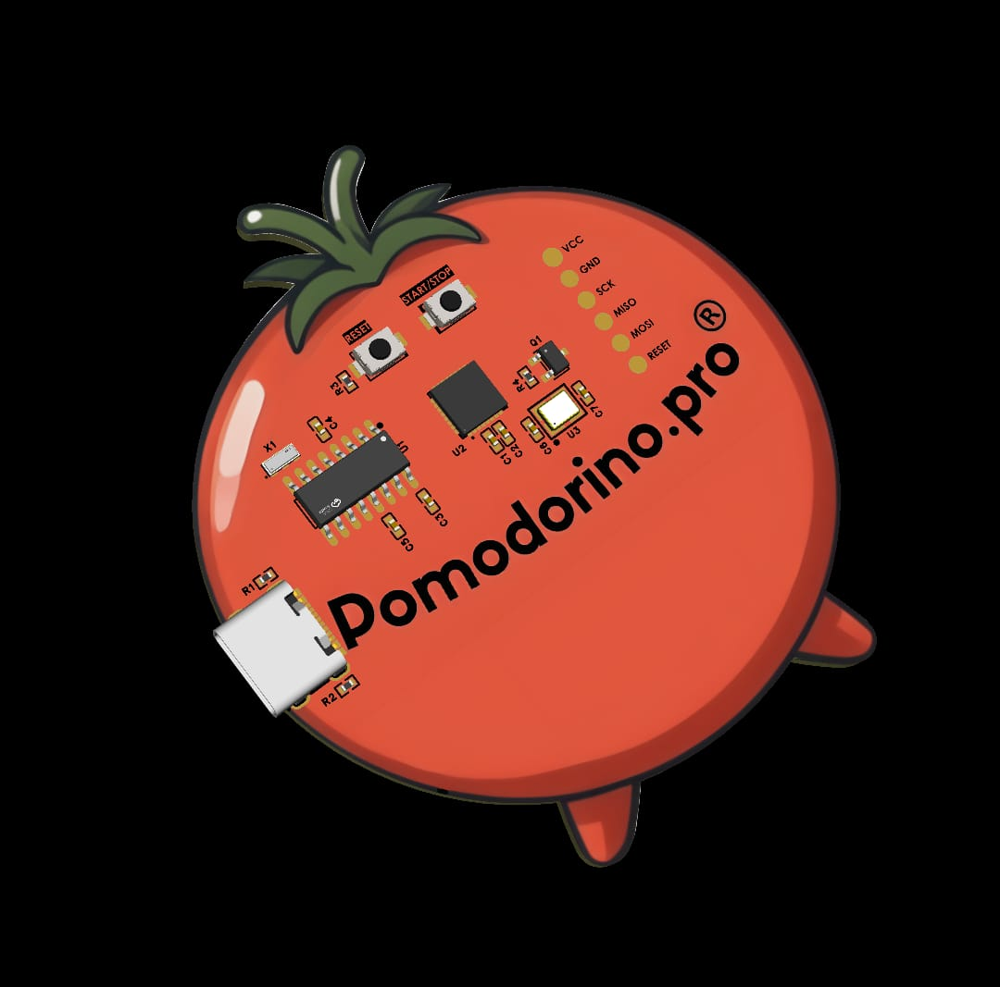
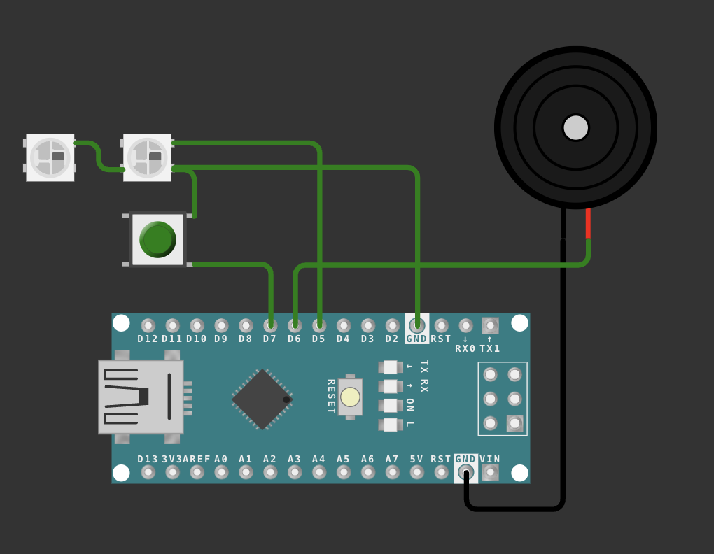

# Pomodora Timer 

A physical Pomodora Timer including the PCB and schematic. This project contains a Wokwi simulation. You will have to apply for your own license in order to test it. The PCB is made with EasyEDA and files are under that name.

Accepting contributions to make this better.

## Project Description

The Pomodora Timer is a simple yet effective tool to help you manage your time using the Pomodoro Technique. It features a physical timer with LED indicators and a buzzer to signal the start and end of focus and break periods. The timer is built using an Arduino Uno, NeoPixel LEDs, a button, and a buzzer. The project includes the following features:

- **Focus Mode**: The timer starts in focus mode, indicated by a red LED. The focus period lasts for a configurable amount of time.
- **Break Mode**: After the focus period, the timer switches to break mode, indicated by a green LED. The break period also lasts for a configurable amount of time.
- **Buzzer Alerts**: The buzzer provides audible alerts at the start and end of each focus and break period.
- **Button Control**: A button is used to start the timer and switch between focus and break modes.

## Shapes Images

### Schematic Diagram

### PCB

### Wokwi Simulation

Feel free to contribute to this project by submitting pull requests or opening issues.
